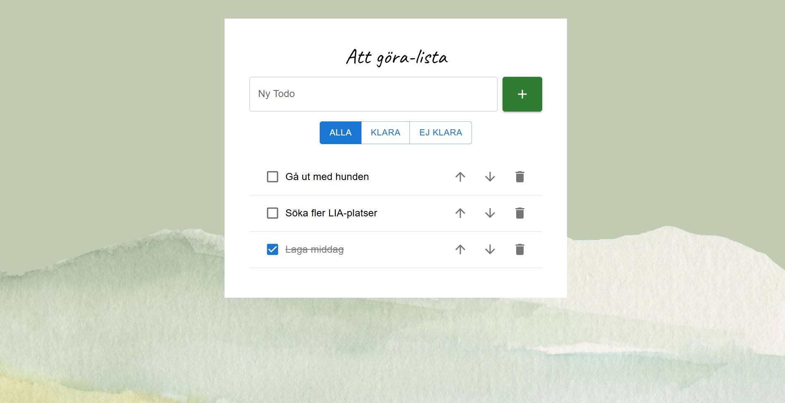

# 📝 Att göra-lista

En enkel och stilren "Att göra-lista"-applikation där användaren kan lägga till, sortera, filtrera och ta bort uppgifter.

Detta projekt skapades som en del av mina studier på Medieinstitutet, och används nu som ett personligt portfolio-projekt inför LIA-ansökan hösten 2025. Applikationen är på svenska och anpassad för svenska användare – med fokus på tydlighet, funktionalitet och ett lugnt, estetiskt tilltalande gränssnitt.

## 🚀 Funktioner

- Lägg till uppgifter
- Markera som klara / ej klara
- Filtrera: Alla, Klara, Ej klara
- Sortera uppgifter (upp/ner)
- Ta bort uppgifter
- Responsiv design
- Svenskt gränssnitt

## 🛠 Tekniker

- React
- TypeScript
- CSS Material UI
- Git & GitHub

## 🌿 Skärmbild



> Ladda upp din skärmbild i projektmappen och döp den till `screenshot.png`  
> (eller justera länken ovan om du använder ett annat filnamn)

## 🌐 Live-demo

👉 [Testa appen här](https://dindemo.netlify.app)

_(Byt ut länken ovan när du laddat upp till Netlify!)_

## 📦 Starta lokalt

```bash
git clone https://github.com/fridadev/todo-app.git
cd todo-app
npm install
npm start
